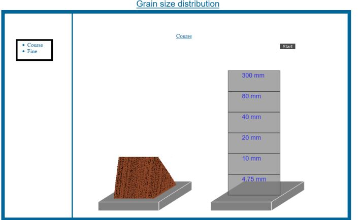

**Experiment Procedure Documentation**

**Introduction**

This document captures the instructions to run the simulation.

**Instructions**

1. To run the experiment, simply run the index2.html file by clicking on it and the experiment will open in the browser.

 
 
2. Select the required type(course or fine) by clicking on the corresponding type names available on the left side of the simulator.

     
3.Click on the start button to start the simulation of the selected type.Click on other flow type for switching  between the flow types(current simulation need not to complete for switching).

  
  

