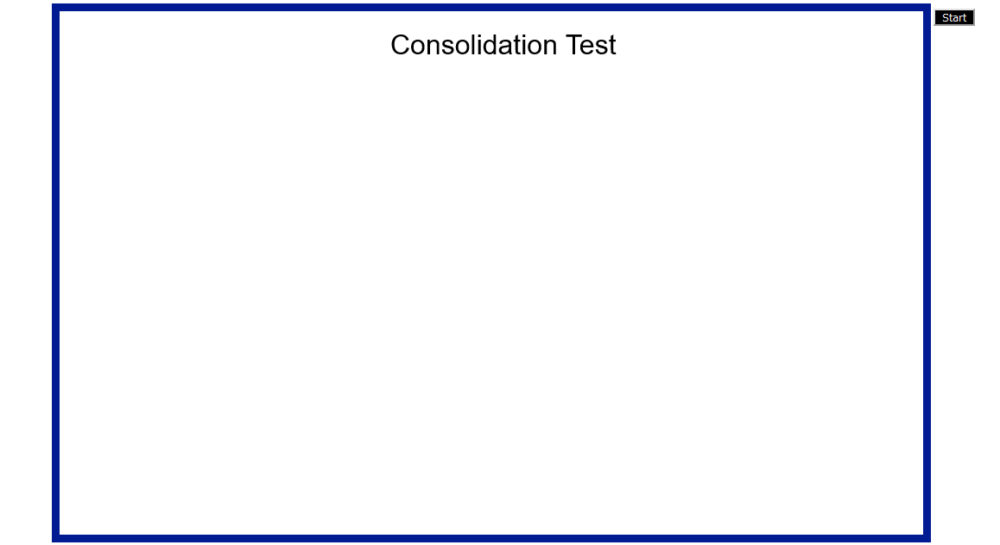

**Experiment Procedure Documentation**

**Introduction**

This document captures the instructions to run the simulation.

**Instructions**

1. To run the experiment, simply run the index.html file by clicking on it and the experiment will open in the browser.

2. To run the experiment of consolidation, click on **Start** button on top right corner.

3. Animation will start, demonstrating the various cases of experiment.

**Case 1** : Load of 1 ton is dropped on soil, compressing soil.

**Case 2** : Load of 5 ton is dropped on soil, compressing soil.

**Case 3** : Load of 10 ton is dropped on soil, compressing soil.

**Case 4** : Load of 10 ton is lifted of the soil, expanding soil.

4. Click on **Start** button again to reset animation.

